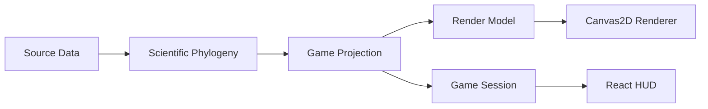

# EVO-TREE Milestone 1 Architecture

## Package boundaries

- `@evo-tree/shared-schemas`: Zod runtime schemas for source inputs.
- `@evo-tree/scientific-data`: `species-list.txt` parsing + repository abstraction.
- `@evo-tree/domain`: core node contracts and scientific-tree algorithms.
- `@evo-tree/game-engine`: difficulty/session state and projection contract shell.
- `@evo-tree/renderer-contracts`: rendering interfaces only.
- `@evo-tree/web`: React HUD and viewport shell.
- `@evo-tree/data-refresh`: explicit data-refresh workflow command entrypoint.

